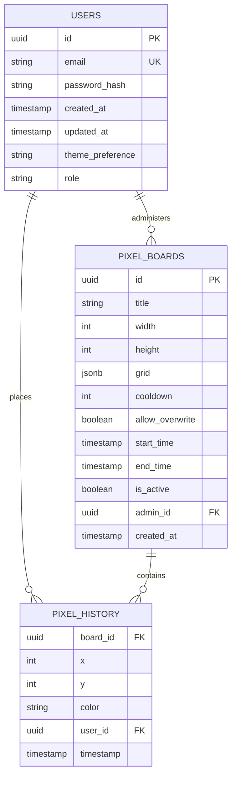

# Schéma de Base de Données pour PixelBoard

Ce document présente le schéma de base de données pour les PixelBoards et les Pixels, qui constitue la structure centrale de notre application d'art pixel collaboratif.

## Structure actuelle

Actuellement, le schéma comprend les tables suivantes:

1. **users** - Stocke les informations des utilisateurs
2. **pixel_boards** - Contient les tableaux d'art pixel et leurs configurations
3. **pixel_history** - Enregistre l'historique des placements de pixels

## Schéma en Mermaid

## Détails des Tables

### Users

| Champ | Type | Description |
|-------|------|-------------|
| id | UUID | Identifiant unique (clé primaire) |
| email | VARCHAR(255) | Email de l'utilisateur (unique) |
| password_hash | VARCHAR(255) | Mot de passe hashé |
| created_at | TIMESTAMPTZ | Date de création |
| updated_at | TIMESTAMPTZ | Date de mise à jour |
| theme_preference | VARCHAR(5) | Préférence de thème (light, dark, sys) |
| role | VARCHAR(10) | Rôle utilisateur (guest, user, premium, admin) |

### Pixel Boards

| Champ | Type | Description |
|-------|------|-------------|
| id | UUID | Identifiant unique (clé primaire) |
| title | VARCHAR(255) | Titre du tableau |
| width | INT | Largeur du tableau (10-1000) |
| height | INT | Hauteur du tableau (10-1000) |
| grid | JSONB | Structure du tableau (format JSON) |
| cooldown | INT | Délai entre placements (secondes) |
| allow_overwrite | BOOLEAN | Autorisation d'écrasement |
| start_time | TIMESTAMPTZ | Date de début |
| end_time | TIMESTAMPTZ | Date de fin |
| is_active | BOOLEAN | Tableau actif (calculé) |
| admin_id | UUID | ID du créateur (clé étrangère) |
| created_at | TIMESTAMPTZ | Date de création |

### Pixel History

| Champ | Type | Description |
|-------|------|-------------|
| board_id | UUID | ID du tableau (clé étrangère) |
| x | INT | Coordonnée X |
| y | INT | Coordonnée Y |
| color | CHAR(7) | Code couleur (format #RRGGBB) |
| user_id | UUID | ID de l'utilisateur (clé étrangère) |
| timestamp | TIMESTAMPTZ | Date du placement |

La clé primaire composite est (board_id, x, y, timestamp).

## Optimisations

1. **Partitionnement par temps** : La table `pixel_history` est partitionnée par plage de dates pour améliorer les performances des requêtes historiques.

2. **Index** : 
   - Index sur (board_id, timestamp) pour accélérer les requêtes d'historique par tableau
   - Index sur (user_id) pour accélérer les requêtes d'historique par utilisateur

3. **Vue matérialisée** : Une vue `board_stats` est utilisée pour calculer et stocker des statistiques agrégées sur les tableaux.

## Implémentation CRUD Future

Les opérations CRUD pour ces entités seront mises en œuvre dans:

1. **Controllers**: 
   - `pixelboard.controller.ts` - Gestion des tableaux
   - `pixel.controller.ts` - Gestion des pixels

2. **Services**:
   - `pixelboard.service.ts` - Logique métier des tableaux
   - `pixel-history.service.ts` - Logique métier des pixels

3. **Routes**:
   - `pixelboard.routes.ts` - Points d'entrée API pour les tableaux
   - `pixel.routes.ts` - Points d'entrée API pour les pixels